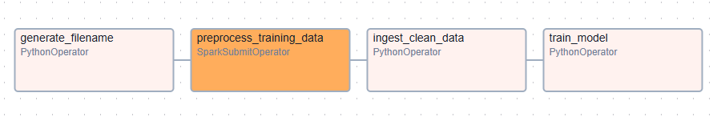
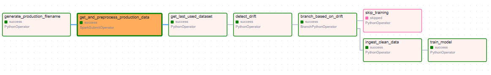
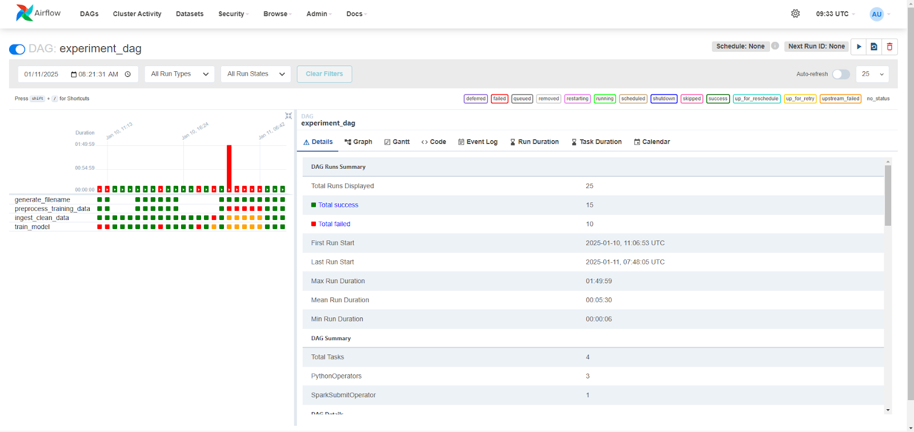
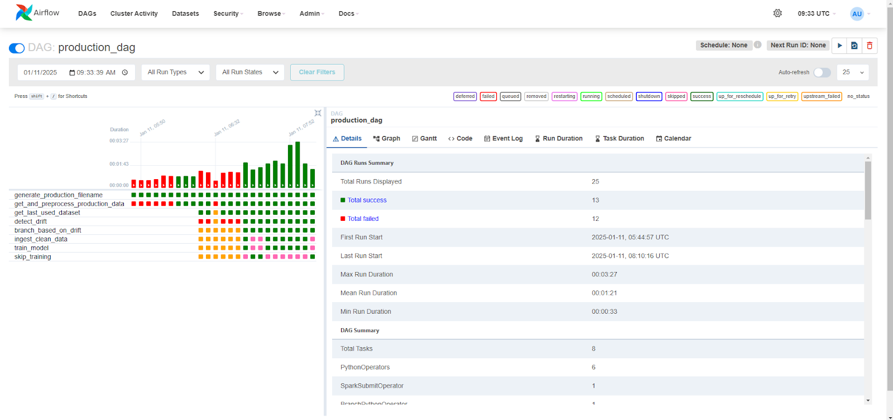
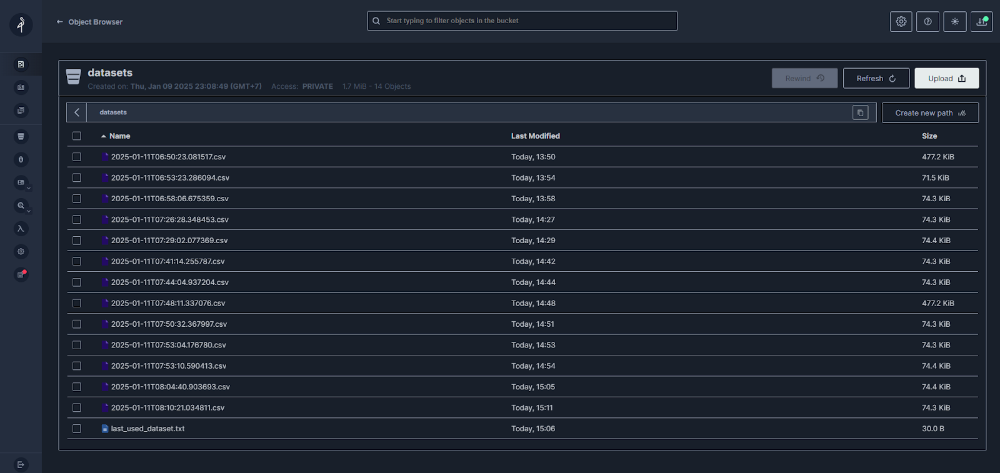
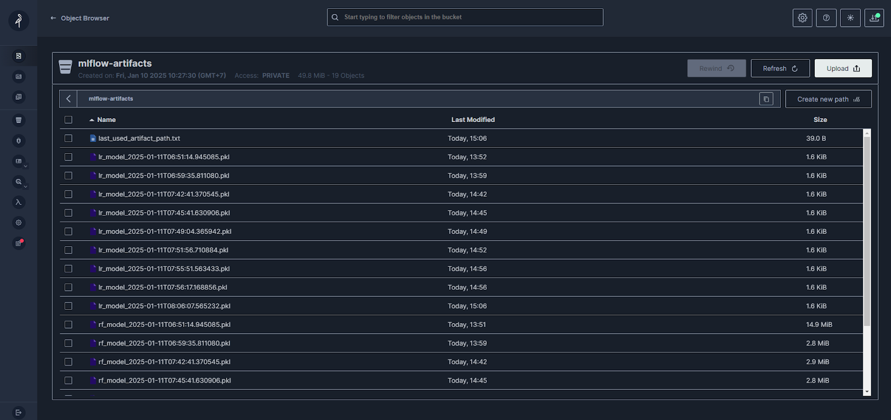
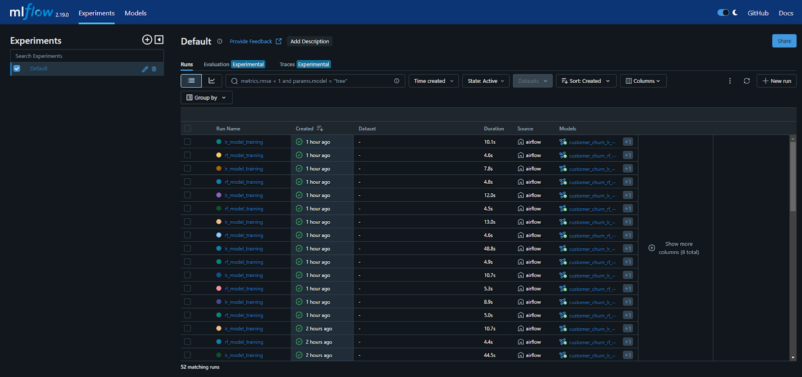
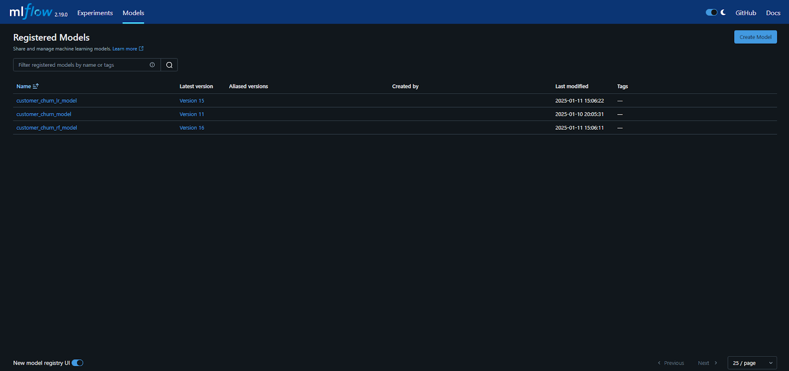
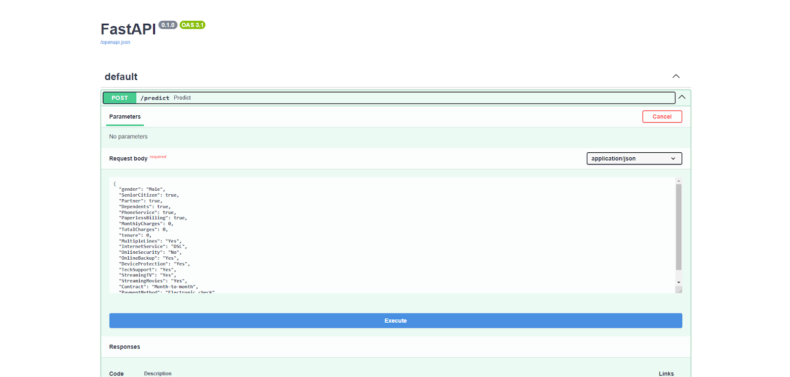
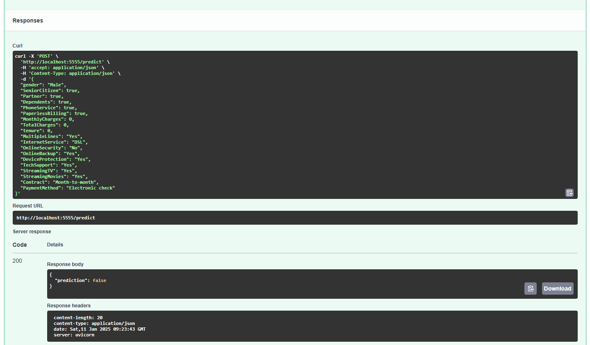

## Customer Churn Prediction Model Pipeline

### IF4054 - Pengoperasian Perangkat Lunak

### How to Run

1. `git clone https://github.com/nathaniacalista01/XOps.git`
2. Run `docker compose up -d` in `root` directory
3. Make sure all containers are running

### Steps for Airflow

1. Open `localhost:8080` to view airflow dashboard
2. Login using the credentials below
   ```bash
   username: admin
   ```
   for password, you can see it from `airflow/standalone_admin_password.txt` after building the container
3. Go to `admin` Menu bar and select `connections`
4. Edit the connection to:
   ```bash
   connection id: spark_default
   host: spark://spark-master
   port: 7077
   ```

### Ports List

1. Spark: `localhost:7077`
2. Model deploy: `localhost:5555`
3. MlFlow: `localhost:5000`
4. Minio: `localhost:9000`
5. Airflow: `localhost:8080`

### Team Member

- 13521100 - Alexander Jason
- 13521139 - Nathania Calista
- 13521170 - Haziq Abiyyu Mahdy

---

## Daftar Isi

- [Pendahuluan](#pendahuluan)
- [Machine Learning Workflow](#machine-learning-workflow)
- [Model Deployment](#model-deployment)
- [Implementasi](#implementasi)
- [Hasil Implementasi](#hasil-implementasi)
- [Kesimpulan](#kesimpulan)
- [Referensi](#referensi)
- [Pembagian Kerja](#pembagian-kerja)
- [Lampiran](#lampiran)

---

## A. Pendahuluan

Dataset "Telco Customer Churn" merupakan kumpulan data pelanggan dari sebuah perusahaan telekomunikasi yang bertujuan untuk menganalisis faktor-faktor yang memengaruhi pelanggan berhenti berlangganan layanan mereka (_churn_). Dataset ini digunakan untuk membangun model prediktif guna mengidentifikasi pelanggan yang berpotensi churn.

**Tabel 1.1. Deskripsi Kolom Dataset**

| No  | Nama Kolom       | Tipe Data | Deskripsi                                                                             |
| --- | ---------------- | --------- | ------------------------------------------------------------------------------------- |
| 1   | customerId       | object    | ID unik untuk setiap pelanggan                                                        |
| 2   | gender           | object    | Jenis kelamin pelanggan (Male/Female)                                                 |
| 3   | SeniorCitizen    | int64     | Indikator apakah pelanggan adalah warga senior (1 = Ya, 0 = Tidak)                    |
| 4   | Partner          | object    | Apakah pelanggan memiliki pasangan (Yes/No)                                           |
| 5   | Dependents       | object    | Apakah pelanggan memiliki tanggungan (Yes/No)                                         |
| 6   | tenure           | int64     | Jumlah bulan pelanggan telah menggunakan layanan                                      |
| 7   | PhoneService     | object    | Apakah pelanggan memiliki layanan telepon (Yes/No)                                    |
| 8   | MultipleLines    | object    | Apakah pelanggan memiliki beberapa jalur telepon (Yes/No/No phone service)            |
| 9   | InternetService  | object    | Jenis layanan internet (DSL, Fiber optic, No)                                         |
| 10  | OnlineSecurity   | object    | Apakah pelanggan memiliki layanan keamanan online (Yes/No/No internet service)        |
| 11  | OnlineBackup     | object    | Apakah pelanggan memiliki layanan pencadangan online (Yes/No/No internet service)     |
| 12  | DeviceProtection | object    | Apakah pelanggan memiliki layanan perlindungan perangkat (Yes/No/No internet service) |
| 13  | TechSupport      | object    | Apakah pelanggan memiliki layanan dukungan teknis (Yes/No/No internet service)        |
| 14  | StreamingTV      | object    | Apakah pelanggan memiliki layanan streaming TV (Yes/No/No internet service)           |
| 15  | StreamingMovies  | object    | Apakah pelanggan memiliki layanan streaming film (Yes/No/No internet service)         |
| 16  | Contract         | object    | Jenis kontrak pelanggan (Month-to-month, One year, Two year)                          |
| 17  | PaperlessBilling | object    | Apakah pelanggan menggunakan penagihan tanpa kertas (Yes/No)                          |
| 18  | PaymentMethod    | object    | Metode pembayaran (Electronic check, Mailed check, Bank transfer, Credit card)        |
| 19  | MonthlyCharges   | float64   | Biaya bulanan yang dibayarkan pelanggan                                               |
| 20  | TotalCharges     | object    | Total biaya yang telah dibayarkan pelanggan selama ini                                |
| 21  | Churn            | object    | Apakah pelanggan berhenti berlangganan (Yes/No)                                       |

---

## B. Machine Learning Workflow

### 1. Experiment DAG



Diagram ini menunjukkan workflow eksperimen, termasuk preprocessing data, pelatihan model, dan pencatatan ke MLflow.

1. Generate Filename
   Pada tahap ini, nama file dibangkitkan berdasarkan timestamp. Nama file ini berguna sebagai object key dari data yang akan dibersihkan pada tahap setelahnya.
2. Preprocess Training Data (Menggunakan Spark)
   Pada tahap ini, dataset diambil dari volume dan diproses untuk membersihkan dan mempersiapkannya untuk langkah berikutnya. Proses mencakup:
   - Menghapus data duplikat.
   - Mengisi atau menghapus nilai yang kosong (N/A).
   - Seleksi fitur untuk memilih atribut yang relevan.
   - Transformasi untuk menyesuaikan format data (seluruh data kategorikal diubah menjadi numerik)
   - Data yang telah diproses akan disimpan ke MinIO menggunakan object key dari tahap sebelumnya
3. Ingest Clean Data
   Data yang telah dibersihkan diambil dari MinIO dan dikonversi menjadi DataFrame yang akan disimpan pada XCom untuk diakses pada tahap Train Model. Setiap kali dataset di-ingest untuk melakukan training, dataset yang di-ingest akan dicatat sebagai `last_used_dataset` untuk dijadikan referensi pada perhitungan PSI.
4. Train Model
   Pada tahap ini, dilakukan eksperimen dengan beberapa algoritma seperti Random Forest dan Logistic Regression. Tiap model akan di-log ke MLFlow beserta konfigurasi model seperti algoritma dan parameter serta metrik yang dihitung. Artefak model dengan metrik terbaik akan dicatat sebagai `last_used_artifact_path` agar dapat diakses oleh service lain.

### 2. Production DAG



Diagram ini menunjukkan alur kerja yang dijalankan secara berkala (tiap 15 menit). Workflow ini dioptimalkan untuk dalam proses production, di mana data selalu dihasilkan secara berkala dan distribusi data dapat berubah dari data training.

1. Generate Production Filename
   Pada tahap ini, nama file dibangkitkan berdasarkan timestamp. Nama file ini berguna sebagai object key dari data yang akan dibersihkan pada tahap setelahnya.
2. Get and Preprocess Production Data (Menggunakan Spark)
   Pada tahap ini, dataset diambil dari script untuk meng-generate data untuk mensimulasikan data production dan diproses seperti tahapan Preprocess Training Data pada Experiment DAG. Data yang telah diproses akan disimpan ke MinIO menggunakan object key dari tahap sebelumnya.
3. Get Last Used Dataset
   Dataset yang terakhir digunakan untuk training (`last_used_dataset`) diambil dari minIO untuk dijadikan referensi pada perhitungan PSI.
4. Detect Drift
   Perhitungan PSI membandingkan antara data production yang dihasilkan pada tahap b dengan `last_used_dataset`. Apabila PSI di atas ambang tertentu, maka terdapat data drift dan diperlukan training ulang dengan dataset baru.
5. Branch Based On Drift
   Pada tahap ini, digunakan BranchPythonOperator untuk menentukan task selanjutnya yang akan dijalankan berdasarkan data drift.
6. Skip Training
   Apabila tidak terdapat data drift, maka tidak diperlukan training ulang.
7. Ingest Clean Data
   Apabila terdapat data drift, maka diperlukan training ulang. Oleh karena itu, data production yang telah diproses sebelumnya akan diambil dari MinIO.
8. Train Model
   Pada tahap ini, dilakukan eksperimen dengan beberapa algoritma seperti Random Forest dan Logistic Regression. Tiap model akan di-log ke MLFlow beserta konfigurasi model seperti algoritma dan parameter serta metrik yang dihitung. Artefak model dengan metrik terbaik akan dicatat sebagai `last_used_artifact_path` agar dapat diakses oleh service lain.

---

## C. Model Deployment

- Model dideploy menggunakan **FastAPI**.
- API `/predict` menerima input dalam format JSON dan mengembalikan prediksi churn.
- Dokumentasi API tersedia di `http://localhost:5555/docs`.

---

## D. Implementasi

Proyek diimplementasikan dengan **Docker** dalam satu node yang terdiri dari:

1. **Airflow** - Orkestrasi alur kerja ML.
2. **Apache Spark** - Pemrosesan data skala besar.
3. **MinIO** - Penyimpanan artefak model dan dataset.
4. **MLflow** - Pengelolaan eksperimen dan model.
5. **FastAPI** - Layanan prediksi berbasis API.

---

## E. Hasil Implementasi

### 1. Status Eksekusi DAG

- **Experiment DAG Runs**
  
- **Production DAG Runs**
  

### 2. Dataset dan Artefak

- **Dataset di MinIO**
  
- **Artefak Model di MinIO**
  

### 3. MLflow

- **Experiment Tracking**
  
- **Model Registry**
  

### 4. API Testing

- **Prediction API Request**
  
- **Prediction API Response**
  

---

## F. Kesimpulan

Proyek ini berhasil mengintegrasikan **Airflow, Spark, MLflow, dan Docker** untuk membangun workflow yang efisien dan scalable.

- MLflow mengelola siklus hidup model
- Airflow mengorkestrasi setiap task pada workflow
- Spark menangani pemrosesan big data secara paralel
- Docker menyediakan lingkungan konsisten untuk pengembangan dan produksi.
  Kombinasi teknologi ini menciptakan workflow yang dapat diandalkan untuk proses machine learning dari data preprocessing hingga deployment.
  Lesson Learned dari tugas ini:

  1. Orkestrasi dengan Airflow
     Airflow mempermudah pengelolaan alur kerja kompleks, tetapi membutuhkan pemahaman mendalam untuk konfigurasi dan debugging.
  2. Pengelolaan Model dengan MLFlow
     Logging, registrasi, dan versioning model dengan MLFlow meningkatkan reprodusibilitas dan transparansi eksperimen machine learning.
  3. Skalabilitas Spark
     Spark memungkinkan preprocessing data dengan cepat, tetapi memerlukan ketelitian ekstra dalam debugging.
  4. Pentingnya Logging dan Error Handling
     Logging sangat diperlukan untuk melihat status program serta debugging.

---

## G. Referensi

- [MLflow](https://mlflow.org/docs/latest/index.html)
- [Apache Spark](https://spark.apache.org/docs/latest/)
- [Apache Airflow](https://airflow.apache.org/docs/)

---

## I. Lampiran

- **Video Presentasi**: [YouTube](https://youtu.be/_EBamoXhTyw)
